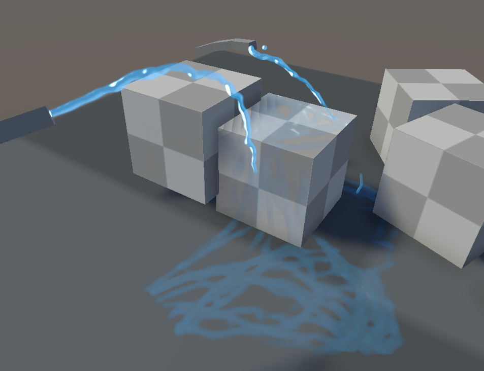

# Fluid Rendering For Games

A set of tools for rendering streams and splats in games. It leans into looking artistically appealing more than being technically correct.

## Features

Great for spurts, splats, laminar streams, and goopy strands. Designed for realtime rendering.
* Uses a post-process Rendering Feature to combine fluid particles into convincing surface-tension clumps.
* Uses Skinned Mesh Decals to "infinitely" splat fluids onto other objects.
* Designed from the ground up to make artsy fluid streams from an isolated package.

## Limitations

* Not easy to use and customize, requires a programmatic approach to integrate.
* Requires a LOT of VRAM, two full-screen screen buffers, and two buffers for every decalable. (RGBA, and RFloat buffers.)
* Pixel complexity is very high, does a height->normal conversion in shader for both decalables and the fullscreen buffer.

## Installation

To install this package, you can use Unity's built-in package manager. Simply add `https://github.com/naelstrof/FluidRenderingForGames.git#upm` as a package.
Change `upm` to the specific tag you want if you don't want the version rug-pulled when it updates.